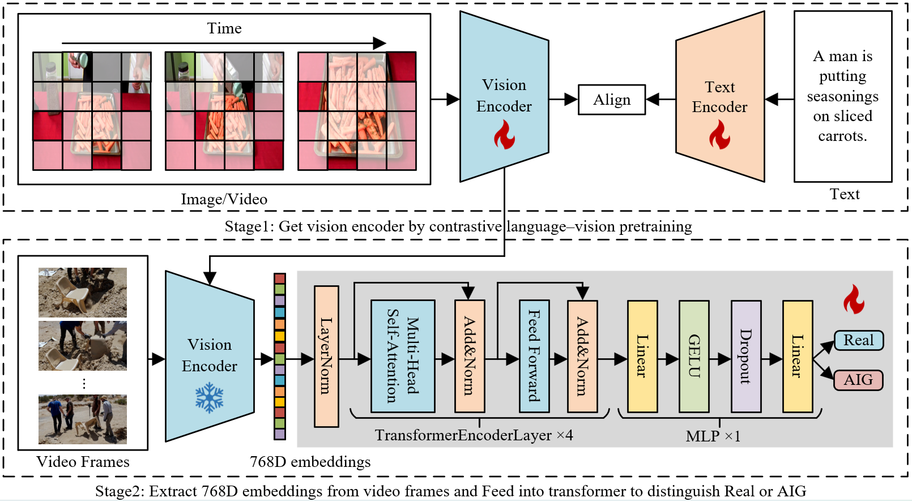

# Paper

This is the official code of paper 'Text-Vision Embedding for Generalized AI-Generated Video Detection'.

# Abstract

The rapid development of generative AI has led to a surge in AI-generated video content, that increases the risk of fake information spreading. Therefore, it is imperative to develop a general and robust detector for AI-generated videos. However, existing detection methods do not have generalized and robust representations. These methods cannot generalize to videos created by multiple generative models. In this paper, we pointed out that text-vision embedding provides a generalizable and robust representation for AI-generated video detection based on success in text-image contrastive learning domain. Visual embeddings in text-visual contrast pre-trained models are naturally separable for real and AI-generated videos. Therefore, we propose a general AI-generated video detection framework that exploits contrastive embeddings between visual content and text semantics to capture generation artifacts. A comprehensive evaluation on multiple video generation models demonstrates the excellent generalization ability of our detector. The average accuracy on unseen synthetic video models is 3.3% higher than existing detection methods. This work establishes a new benchmark for AI-generated video detection.

# Pipline



# Installation

Execute the command to install Pytorch

```bash
pip install torch==1.13.1+cu117 torchvision==0.14.1+cu117 torchaudio==0.13.1 --extra-index-url https://download.pytorch.org/whl/cu117
```

Execute the command to install other dependencies

```bash
pip install moviepy opencv-python albumentations einops timm scikit-learn tqdm transformers
```

Download the dataset from https://modelscope.cn/datasets/cccnju/Gen-Video/files

# Preprocess

Modify the following code to adapt your data set storage. Decode the video into frames, Create index files and Split train and validation set.

```bash
cd preprocess
python video2frame.py --video_dir your-video-dir --save_dir your-video-frames-dir
python file_index.py --root_dir your-video-frames-dir --txt_file your-index-file-save-path
python split_val.py
```

# Train

Download the video encoder weights for ViCLIP from https://drive.google.com/file/d/1umwgDanL70qsFbrUCkqjLOpLwJ9mlWsN/view?usp=sharing and place them in the ./model/ directory.

```bash
python train.py
```

# Test

Download the trained weights from https://drive.google.com/file/d/1umwgDanL70qsFbrUCkqjLOpLwJ9mlWsN/view?usp=sharing and place them in the ./model/ directory.

```bash
python test.py
```

# Acknowledgments

Thanks to the nice work of 

VideoMAE : https://huggingface.co/MCG-NJU/videomae-base

CLIP : https://github.com/openai/CLIP 

XCLIP : https://github.com/microsoft/VideoX/tree/master/X-CLIP

ViCLIP : https://github.com/OpenGVLab/InternVideo/tree/main/Data/InternVid

DeMamba : https://github.com/chenhaoxing/DeMamba
